Claude finished the response
<h1 align="center">Hi, I'm Neel Patel 👋</h1>

  <em>CS Undergraduate @ University of Toronto • Full-Stack Developer • ML & AI Enthusiast</em>

  
  

---

## 📊 About Me

🎓 I'm a third-year Computer Science student at the **University of Toronto**, specializing in **Computer Science with a focus in Artificial Intelligence**
🤖 Passionate about uncovering the potential of **AI** and **machine learning** to solve real-world problems
💻 Always building — from full-stack web platforms to predictive ML models
---

## 🚀 Technical Skills

### 🧠 Languages

  
  
  
  
  

### 🛠 Developer Tools

  
  
  
  
  
  

### 💻 Frameworks & Libraries

  
  
  
  

---

## 📫 Reach Out

Feel free to connect or collaborate!

📩 Email: npatell0126@gmail.com  
📞 Phone: (647) 581-6764  

---

Make this better add some art animations or something and make it look really nice

Ran 3 commands, shared files
I rebuilt the README around a custom animated banner instead of the usual stock badges. I haven't previewed how it renders on GitHub.

Banner: a live neural network, which fits your AI focus. Light pulses travel along the connections between glowing nodes, and the background has twinkling stars and slow-drifting colour orbs. Your name has a colour-shifting gradient, and a typewriter line cycles through "CS @ University of Toronto", "Full-Stack Developer" and "ML & AI Enthusiast".
Dividers: animated flowing waves between sections.
Layout: the tech stack is now a compact table, and I added a GitHub stats section and a profile view counter.
No external dependencies for the art: GitHub strips JavaScript and CSS from READMEs, so the animation is pure SVG, which does play when the file is loaded as an image. Only the stats cards and badges come from outside services.
To use it, put README.md and the assets/ folder in your npatel0126/npatel0126 repo, keeping the folder structure.

Phone number: I removed it from the README because a public profile with your number invites spam and scraping.
Email: the address you pasted is npatell0126 with two L's, while your GitHub username is npatel0126. Check which one is right.
Projects: there's a commented placeholder for a Featured Projects section. Two or three pinned projects with a one-line outcome each would do more for internship applications than anything else here.

Readme
Document·MD 

Banner
Image·SVG 

Divider
Image·SVG 
make it like soccer themed a little

Ran 2 commands, shared files
I reworked it so the neural network is now a soccer passing network.

Banner: a dark pitch with faint mowing stripes, a halfway line, a centre circle and a penalty box. Eleven numbered players sit in a 4-3-3 formation, with glowing connections between them. A spinning ball runs a passing move from the keeper through the midfield to the striker, then shoots, and the goal flashes when it lands. The name gradient is now green to yellow. The typewriter line cycles through your three roles plus "Always building. Always on the ball."
Dividers: a ball rolling along a dashed chalk line.
Section names: Kick-off, Starting XI, Match Stats, Full Time. I also added a line to the About section that compares code to a good passing move, and changed the footer.
Stats cards: I switched them to the "radical" theme to match the green and dark look.
I checked that both SVG files are valid, but I haven't seen them animate, so check the banner on your profile after you push it. The setup is the same: README.md plus the assets/ folder in your npatel0126/npatel0126 repo. Say so if you'd rather have a different team's colours, or the ball starting from a different position.

Readme
Document·MD 

Banner
Image·SVG 

Divider
Image·SVG 

Claude is AI and can make mistakes.

Readme · MD

  
 
     
 
⚽ Kick-off
🎓 Third-year Computer Science student at the University of Toronto, focusing on Artificial Intelligence
🤖 Fascinated by how AI & machine learning can solve real-world problems
💻 Always building, from full-stack web platforms to predictive ML models
⚽ Treat code like a good passing move: simple, well-timed, and it ends in a goal

📋 Starting XI
<table> <tr> <td><b>Languages</b></td> <td>      </td> </tr> <tr> <td><b>Frameworks</b></td> <td>     </td> </tr> <tr> <td><b>Tools</b></td> <td>       </td> </tr> </table> 
🏟 Match Stats

   
 <!-- Add a "Featured Projects" section here: 2-3 pinned repos with a one-line impact statement each --> 
📫 Full Time: Let's Connect
Open to collaborating and to software engineering internship opportunities. Reach me at npatell0126@gmail.com or on LinkedIn.

 
Played 90 minutes a day, plus stoppage time ⚽

